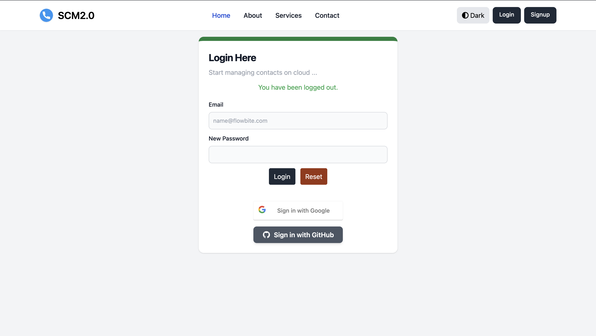

# 📇 Smart Contact Manager


Smart Contact Manager is a web-based application built using **Spring Boot**, **Thymeleaf**, and **Tailwind CSS**. It provides a secure and user-friendly platform for managing your contacts. Users can store contact details like email and social media profiles, and send messages directly through the website.

---

## ✨ Features

- ✅ **Secure Contact Management**: Add, update, and delete contacts with their associated LinkedIn, Email, and other social media profiles.
- ✅ **Direct Messaging**: Send messages directly through social media links.
- ✅ **User Authentication**:
  - Email verification for user registration.
  - Two-factor authentication for added security.
- ✅ **Modern UI**: Built with **Tailwind CSS** for a responsive and visually appealing interface.
- ✅ **Data Integrity**: The API architecture ensures data reliability and security using **Spring Boot** and **MySQL**.
- ✅ **Error Handling**: Comprehensive error responses for better user experience.

---

## 🚀 Tech Stack

- **Spring Boot**: Backend framework for building REST APIs.
- **Thymeleaf**: Template engine for dynamic HTML rendering.
- **Tailwind CSS**: Utility-first CSS framework for a responsive UI.
- **Spring Security**: Secures the app with features like authentication, authorization, and password hashing.
- **MySQL**: Relational database for storing user and contact data.
- **HTML5 & Thymeleaf**: For the frontend.
- **Bootstrap**: Additional styling for responsiveness.

---

## 📸 Screenshots

| **Login Page**                               | **Dashboard**                                | **Add Contact**                              |
|----------------------------------------------|----------------------------------------------|----------------------------------------------|
|     |       |   |

---

## 🛠️ Getting Started

To set up the project locally, follow these steps:

### Prerequisites

- [Java 11+](https://www.oracle.com/java/technologies/javase-jdk11-downloads.html)
- [Maven](https://maven.apache.org/install.html)
- [MySQL](https://dev.mysql.com/downloads/installer/)

### Installation

1. **Clone the Repository**:

   ```bash
   git clone https://github.com/your-username/smart-contact-manager.git
   cd smart-contact-manager
2. **Configure the Database**:
   Update the application.properties file with your MySQL credentials:
   ```bash
   spring.datasource.url=jdbc:mysql://localhost:3306/contact_manager
   spring.datasource.username=your-username
   spring.datasource.password=your-password
3. **Configure the OAuth2**
4. **Run the Application**
   ```bash
   mvn spring-boot:run


### Key Directories and Files:

- **`controllers/`**: Contains Spring MVC controllers that handle HTTP requests and responses.
- **`services/`**: Business logic is implemented here, often interacting with repositories to fetch or persist data.
- **`entities/`**: Java Persistence API (JPA) entities that represent the database tables.
- **`repositories/`**: Spring Data JPA repositories for database operations.
- **`config/`**: Contains configuration files for security (Spring Security, OAuth2), etc.
- **`static/`**: Contains static files like CSS, JavaScript, and images.
- **`templates/`**: Thymeleaf templates that serve dynamic HTML content to users.
- **`application.properties`**: Configuration properties for the application, such as database connections, OAuth2 credentials, etc.
- **`pom.xml`**: The Maven Project Object Model file that manages dependencies and build configurations.

---

This structure follows the standard Spring Boot application convention, ensuring that your project is modular, maintainable, and easy to understand.


## 🔑 Security

The Smart Contact Manager application implements robust security measures using **Spring Security** to protect user data and ensure a secure experience.

- **🔐 Spring Security**: Provides authentication and authorization, ensuring that only authorized users can access protected resources.
- **✉️ Email Verification**: Ensures that users register with a valid email by sending a verification link upon registration.
- **🔒 Two-Factor Authentication (2FA)**: Adds an additional layer of security by requiring a second form of authentication beyond just the password.
- **🛡️ CSRF Protection**: Built-in protection against Cross-Site Request Forgery (CSRF) attacks, ensuring that unauthorized actions cannot be performed on behalf of authenticated users.
- **🔑 Password Encryption**: User passwords are securely hashed and stored using industry-standard encryption algorithms to protect against data breaches.

## 📞 Contact

For any inquiries, feel free to reach out:

- **👤 Name**: Govind Kumar
- **✉️ Email**: [gk485609@gmail.com](mailto:gk485609@gmail.com)
- **🔗 LinkedIn**: [Govind Kumar](https://www.linkedin.com/in/govind-kumar-b18189216/r)

